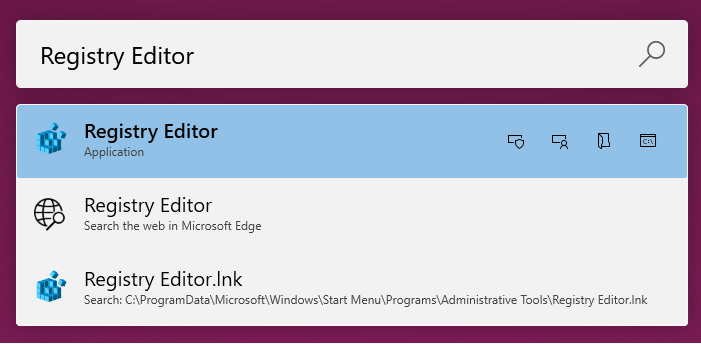

# Windows-Registry-Tweaks
This Repository demonstrates how you can make Windows better through Registry Editor. 
⚠️Note! This is intended for users who are more over advanced in the use of Windows and know the mechanics of Microsoft Windows

**Not providing any files apart from Registry Keys. Below is some you can use for Windows 8 - 11!

## Settings that are also Registry
Even though most of these following hacks can be done through Windows Settings, here is how to do it anyways!

### **1. Disable Aero Shake**

   
   
   The Aero Shake feature allows you to minimise the other windows by shaking nearby it. You may not have realised you even had such feature, but even if you knew, you might not want it. This is removeable through the Windows System Settings for Windows 11 but for any previous versions of Windows (10 and before) this is how to remove this feature.

   1. Open the Registry Editor:
     

**Step 1**: Navigate to the following path:
	***Computer\HKEY_CURRENT_USER\Software\Microsoft\Windows\CurrentVersion\Explorer\Advanced***

 

 **Step 2** Right-click an empty space in the right side pane, select **New > DWORD (32-bit),** then name it **DisallowShaking**

 

 Double click the entry you just created, then change the Value Data to **1** and click **OK**
